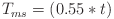
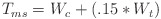

## Optimisations

This page is more for what is the most expensive on the server / client.

### Amimagi

Animagi don't have a noticeable effect on the tick rate unless they are in a transformed state.  



Where t = transformed animagi

### Werewolves

Werewolves are only costly when they are being controlled by the player due to Wolfsbane.  



Where W = Werewolves present
and c = controlled werewolves
and t = transformed werewolves

### The Worst Function

`hp:player/get_motion` is a pain.  
This function calculates the players motion and stores it as there Y score.  
This is the only way to get the length of the motion vector because of [MC-122814](https://bugs.mojang.com/browse/MC-122814) which is considered resolved

The contents of the get_motion file are 10 lines of code which do take up considerable time:

```mcfunction
scoreboard players operation @s X = @s motionX
scoreboard players operation @s Z = @s motionZ

execute store result score @s motionX run data get entity @s Pos[0] 100
execute store result score @s motionZ run data get entity @s Pos[2] 100

scoreboard players operation @s X -= @s motionX
scoreboard players operation @s Z -= @s motionZ

scoreboard players operation @s X *= @s X
scoreboard players operation @s Z *= @s Z

scoreboard players operation @s Y = @s X
scoreboard players operation @s Y += @s Z
```

These operations are unfortunately quite costly.